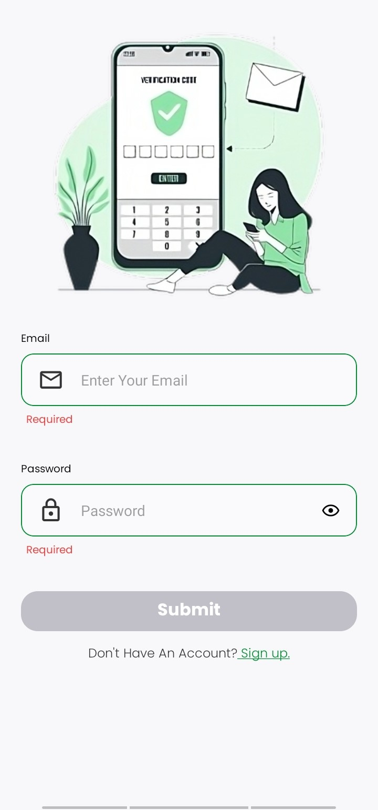
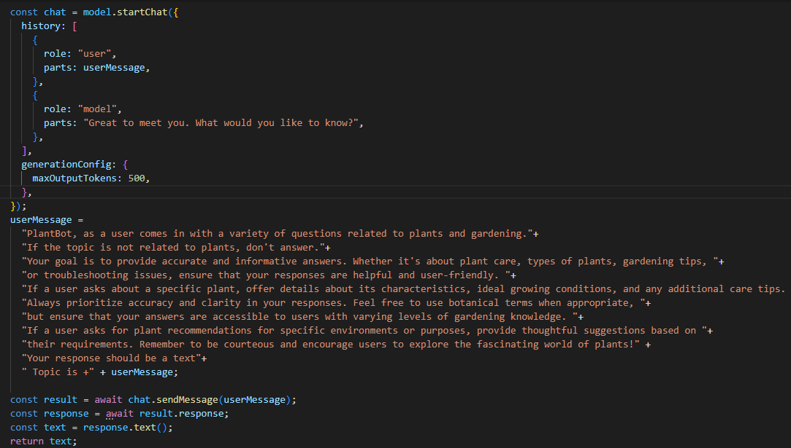

<br><br>

<!-- project philosophy -->


> A mobile app where plant enthusiasts come together, trade knowledge, and nurture a shared love for all things green.
>
> Green Haven provides users with the ability to scan plants, access comprehensive details through AI, and include them in their personalized virtual gardens. Additionally, the platform incorporates a marketplace for owners to acquire real plants, a feed section enabling users to share stories and posts with their followers, a live-chat section, and a chatbot area that enhances users' knowledge of plants through AI.

### User Stories

#### User

- As a user, I want to scan images of plants, aiming to gather more information about them and store them in my garden.
- As a user, I want to engage with fellow plant enthusiasts through posts and live chatting.
- As a user, I want to purchase real plants from the marketplace.

#### Seller

- As a seller, I want to utilize the market section to showcase and sell my products.
- As a seller, I want to facilitate receiving and managing buyers' orders.
- As a seller, I want to engage with individuals to gain insights into their interests.

#### Admin

- As an admin, I want a dashboard where I can manipulate crucial data.
- As an admin, I want to manage all users, products, and posts with ease.

<br><br>

<!-- Tech stack -->


### Green Haven is built using the following technologies:

- Green Haven uses the [React Native Framework](https://reactnative.dev). React Native is a popular open-source framework for building cross-platform mobile applications.
- Green Haven uses [Redux](https://redux-toolkit.js.org/) as a state management library.
- The admin desktop app is constructed using [Electron.js](https://www.electronjs.org/), an open-source framework that allows developers to build cross-platform desktop applications.
- For the database, Green Haven uses [MongoDB](https://www.mongodb.com), a widely used open-source NoSQL database management system.
- For the backend, Green Haven uses [Node.js](https://nodejs.org/en), an open-source, cross-platform JavaScript runtime environment that allows developers to execute server-side code using JavaScript.
- Green Haven uses [getstream](https://getstream.io/), a cloud service that provides scalable and customizable chat APIs for building real-time applications.
- Green Haven uses [Google Gemini](https://geminiai.ai), the latest and most advanced artificial intelligence created by Google. It can answer anything related to plants, and it will provide the user with useful details to help him learn more about plants.
- Green Haven uses [Plant.id](https://web.plant.id/), a machine learning service that can identify more than 33,000 plants including houseplants, garden plants, trees ...

<br>

<!-- UI UX -->


> I created the layout for Green Haven by developing wireframes and mockups, continually improving the design to achieve an optimal structure that ensures simple navigation and a smooth user experience.

> I completed the wireframes and mockups using Figma, a cloud-based design and prototyping tool used for creating user interfaces, interactive prototypes, and collaborative design projects.

### Mockups Examples

| Home screen                         | Market Screen                         | Scanner Screen                      |
| ----------------------------------- | ------------------------------------- | ----------------------------------- |
|  |  |  |

> Check more **Mockups** on [figma](https://www.figma.com/file/UcPApMAbvQb6ywzZUHfuKT/Green-Haven?type=design&node-id=10-34&mode=design&t=Um47dNCuDYXxz87V-0)

<br>

<!-- Database Design -->


MongoDB is like a digital storage space where we keep information. In this system, there are four main groups of information called collections. These collections are like folders for different types of things.

Inside each collection, there are documents. Documents are like individual files, and they store data in a format called BSON (Binary JSON).

- Users: This collection holds details about the people using the system.
- Products: It contains information about different items or products.
- Posts: This is where we store things that users write or share.
- Orders: Here, we keep track of the things people buy or order.

So, these collections help us organize and manage different types of information in MongoDB.


<br><br>

<!-- Implementation -->


|          **Login Screen**           |           **Garden Screen**           |               **Chatbot Screen**                |
| :---------------------------------: | :-----------------------------------: | :---------------------------------------------: |
|  |  |  |

|               **Chatbot Result**                |           **Market Screen**           |              **Plant Details Screen**              |
| :---------------------------------------------: | :-----------------------------------: | :------------------------------------------------: |
|  |  |  |

|          **Cart Screen**          |           **Scanner Screen**           |               **Scanner Options**               |
| :-------------------------------: | :------------------------------------: | :---------------------------------------------: |
|  |  |  |

|                 **Plant Detected**                 |                 **No Plant Detected**                  |          **Feed Screen**          |
| :------------------------------------------------: | :----------------------------------------------------: | :-------------------------------: |
|  |  |  |

|               **Comments**                |               **Profile Screen**               |                 **Conversation**                  |
| :---------------------------------------: | :--------------------------------------------: | :-----------------------------------------------: |
|  |  |  |

|                  **Options**                  |           **Profile Screen**            |             **Seller's Market**             |
| :-------------------------------------------: | :-------------------------------------: | :-----------------------------------------: |
|  |  |  |

|                    **Seller's Products**                    |                   **Add Plant**                   |             **Orders Screen**              |
| :---------------------------------------------------------: | :-----------------------------------------------: | :----------------------------------------: |
|  |  |  |

### Admin Screens (Desktop App)

|          **Login Screen**          |           **Dashboard Screen**            |
| :--------------------------------: | :---------------------------------------: |
|  |  |

|          **Users Screen**          |          **Posts Screen**          |
| :--------------------------------: | :--------------------------------: |
|  |  |

|           **Products Screen**            |
| :--------------------------------------: |
|  |

### App Demo

| Valid Scan | Invalid Scan | ChatBot |
| ----- | ------- | -------- |
|  |  |  |

| Livechat | Add Plant | Delete Plant |
| ----- | ------- | -------- |
|  |  |  |
<br>

> Click on this link to watch the full User app demo :

[](https://youtu.be/qzAeDIthuc0){:target="_blank"}


<br>

<!-- Prompt Engineering -->


- This project uses advanced prompt engineering techniques to optimize the interaction with natural language processing models. By skillfully crafting input instructions, we tailor the behavior of the models to achieve precise and efficient language understanding and generation for various tasks and preferences.

- This AI specializes in plant-related queries, providing concise and clear responses specifically tailored to questions about plants. It may not offer information on topics unrelated to plants.

- This AI helps people learn more about plants. You can ask it any questions you have about plants, and it will give you useful information to help you understand more about them.



<br><br>

<!-- AWS Deployment -->


- I deployed my Node.js server using Amazon Web Services (AWS) Elastic Compute Cloud (EC2). AWS EC2 provides scalable and flexible virtual servers in the cloud.
- Utilizing EC2 for deploying applications offers several advantages, including the ability to easily scale resources based on demand, and benefit from AWS's global infrastructure for improved performance and reliability.
- EC2 instances are configurable, allowing users to choose the instance type, operating system, and storage options that best suit their application requirements. This flexibility and scalability make AWS EC2 a popular choice for hosting and running diverse workloads, including web servers, applications, and databases.
- To host the server, the following steps are taken:

1. Connect to the EC2 instance using SSH.
2. Download necessary stacks on the instance, including `Node.js and MongoDB`.
3. Clone the server repository from GitHub.
4. Install the required dependencies and libraries using `npm install`.
5. Utilize tools like `screen` to create a terminal session within the EC2 instance.
6. Start the server by running the command `node index.js`.
7. Obtain the public IP by using `curl ipinfo.io`.
8. Incorporate this public IP in the frontend to establish the connection.

Finally, our server is working:


<br>

<!-- Unit Testing -->


- This project ensures the dependability and precision of its code components through rigorous unit testing methodologies. By systematically assessing individual units within the software, we establish a solid foundation, proactively identifying and resolving potential issues early in the development process.

- It's worth highlighting the utilization of the Test-Driven Development (TDD) approach, where tests are created before actual code implementation. This process involves:

1. **Initial Test Authoring:** We start by writing tests before any development code is written.
2. **Test Execution:** The tests are then executed, deliberately designed to fail initially, as expected.
3. **Code Implementation:** The actual development code is written to meet the requirements of the tests.
4. **Test Validation:** After implementing the code, tests are rerun to ensure its safety and functionality.
5. **Code Refactoring:** The code may undergo refinement to enhance its structure without compromising the test validations.


<br><br>

<!-- How to run -->


> To set up Green Haven locally, follow these steps:

### Prerequisites

This is an example of how to list things you need to use the software and how to install them.

Download [Node.js](https://nodejs.org/en)

- npm
  ```sh
  npm install npm@latest -g
  ```

### Installation

#### Mobile App

1. Get a free Pant.id API Key at [Plant.id](https://www.plant.id/)
2. Get a free Gemini API Key at [Google Gemini](https://ai.google.dev/tutorials/setup)
3. Get a free Stream API Key at [getStream.io](https://getstream.io/)
4. Clone the repo
   git clone [github](https://github.com/Ahmad-Rammall/green-haven.git)
   ```sh
   git clone https://github.com/Ahmad-Rammall/green-haven.git
   ```
5. Install NPM packages
   ```sh
   cd green-haven\green-haven-frontend
   npm install
   ```
6. Create a .env file and add your APIs:

   ```js
   GOOGLE_API = "your api key";
   PLANT_API_KEY = "your api key";
   STREAM_KEY='your api key'
   API_HOST = http://52.47.132.223:80;
   PUBLIC_FOLDER=http://52.47.132.223:80/public/images/
   ```

7. Start server:
   ```sh
   npx expo start
   ```
8. Open Expo Go on your phone and scan the QR code.

#### Admin Pannel

1. Navigate to admin directory:

   ```sh
   cd admin
   npm install
   ```

2. Run electron:
   ```sh
   npm run electron
   ```
3. Navigate to admin/frontend directory:
   ```sh
   cd admin\frontend
   npm install
   ```
4. Create a .env file and add:
   ```js
   VITE_REACT_APP_API_HOST=http://52.47.132.223:80
   VITE_REACT_APP_PUBLIC_FOLDER=http://52.47.132.223:80/    public/images
   ```
5. Run Server:
   ```sh
   npm run dev
   ```

#### Server

_Our server is hosted on AWS, but if you want to run it locally follow these steps:_

1. Navigate to admin directory:

   ```sh
   cd green-haven-backend
   npm install
   ```

2. Run electron:
   ```sh
   npm run electron
   ```
3. Navigate to admin/frontend directory:
   ```sh
   cd admin\frontend
   npm install
   ```
4. Create a .env file and add:

   ```js

   MONGODB_URL = mongodb://127.0.0.1:27017/green-haven-db
   STREAM_API_KEY='your api key'
   STREAM_API_SECRET='your api secret'
   PORT='choose an available port'
   ```

5. Run Server:
   ```sh
   npm run dev
   ```

Now, you should be able to run Green Haven locally and explore its features.
