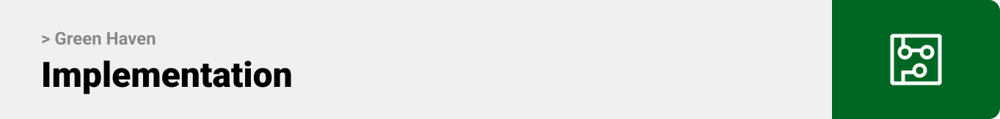
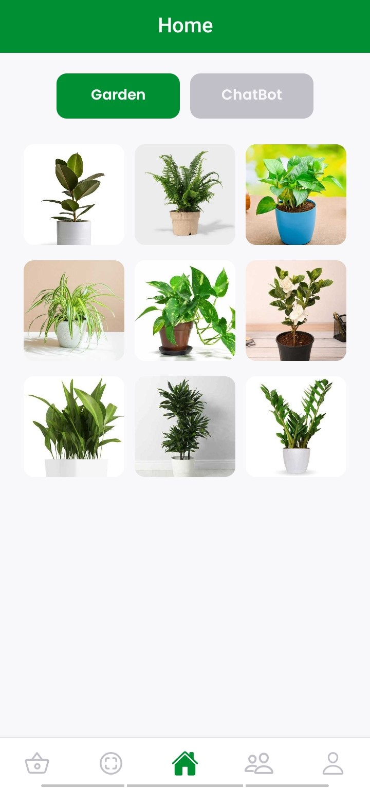

<br><br>

<!-- project philosophy -->


> A mobile app where plant enthusiasts come together, trade knowledge, and nurture a shared love for all things green.
>
> Green Haven provides users with the ability to scan plants, access comprehensive details through AI, and include them in their personalized virtual gardens. Additionally, the platform incorporates a marketplace for owners to acquire real plants, a feed section enabling users to share stories and posts with their followers, a live-chat section, and a chatbot area that enhances users' knowledge of plants through AI.

### User Stories

#### User :

- As a user, I want to scan images of plants, aiming to gather more information about them and store them in my garden.
- As a user, I want to engage with fellow plant enthusiasts through posts and live chatting.
- As a user, I want to purchase real plants from the marketplace.

#### Seller :

- As a seller, I want to utilize the market section to showcase and sell my products.
- As a seller, I want to facilitate receiving and managing buyers' orders.
- As a seller, I want to engage with individuals to gain insights into their interests.

#### Admin :

- As an admin, I want a dashboard where I can manipulate crucial data.
- As an admin, I want to manage all users, products, and posts with ease.

<br><br>

<!-- Tech stack -->


### Green Haven is built using the following technologies:

- Green Haven uses the [React Native Framework](https://reactnative.dev). React Native is a popular open-source framework for building cross-platform mobile applications.
- For the database, Green Haven uses [MongoDB](https://www.mongodb.com), a widely used open-source NoSQL database management system.
- For the backend, Green Haven uses [Node.js](https://nodejs.org/en), an open-source, cross-platform JavaScript runtime environment that allows developers to execute server-side code using JavaScript.
- Green Haven uses [getstream](https://getstream.io/), a cloud service that provides scalable and customizable chat APIs for building real-time applications.
- Green Haven uses [Google Gemini](https://geminiai.ai), the latest and most advanced artificial intelligence created by Google.
- Green Haven uses [Plant.id](https://web.plant.id/), a machine learning service that can identify more than 33,000 plants including houseplants, garden plants, trees ...

<br><br>

<!-- UI UX -->


> I created the layout for Green Haven by developing wireframes and mockups, continually improving the design to achieve an optimal structure that ensures simple navigation and a smooth user experience.

- Project Figma design [figma](https://www.figma.com/file/UcPApMAbvQb6ywzZUHfuKT/Green-Haven?type=design&node-id=10-34&mode=design&t=Um47dNCuDYXxz87V-0)

### Mockups

| Home screen                             | Market Screen                           | Scanner Screen                          |
| --------------------------------------- | ------------------------------------- | ------------------------------------- |
|  |  |  |

<br><br>

<!-- Database Design -->


### Architecting Data Excellence: Innovative Database Design Strategies:

MongoDB is like a digital storage space where we keep information. In this system, there are four main groups of information called collections. These collections are like folders for different types of things. 

Inside each collection, there are documents. Documents are like individual files, and they store data in a format called BSON (Binary JSON).

- Users: This collection holds details about the people using the system.
- Products: It contains information about different items or products.
- Posts: This is where we store things that users write or share.
- Orders: Here, we keep track of the things people buy or order.

So, these collections help us organize and manage different types of information in MongoDB.


<br><br>

<!-- Implementation -->


### User Screens (Mobile)

| Login screen                              | Register screen                         |                            |                            |
| ----------------------------------------- | --------------------------------------- | --------------------------------------- | --------------------------------------- |
|        |  |                            |                            |

| Garden screen                               | Chatbot Screen                             | Chatbot Result                            | 
| ----------------------------------------- | --------------------------------------- | --------------------------------------- |
|      |  |  |

| Market screen                              | Plant details screen                         | Cart screen                          | Location modal                          
| ----------------------------------------- | --------------------------------------- | --------------------------------------- | --------------------------------------- |
|      |  |  |  |

| Scanner screen         |Scanner Options      | Plant detected                        | No plant detected                        | 
| ----------------------------------------- | --------------------------------------- | --------------------------------------- | --------------------------------------- |
|     |  |  |  |

| Feed screen                              | Comments                       | Add Post                           | Profile screen                          |
| ----------------------------------------- | --------------------------------------- | --------------------------------------- | --------------------------------------- |
|          |  |  |  |

| Chat screen                              | Conversation                                | Options
| ----------------------------------------- | --------------------------------------- | --------------------------------------- |
|        |  |  |

| Profile screen                              | Edit Profile                                | Change Password
| ----------------------------------------- | --------------------------------------- | --------------------------------------- |
|    |  |  |

---

### Seller Screens

| Market screen                              | Product options                         | Add Plant                           | Orders screen                          |
| ----------------------------------------- | --------------------------------------- | --------------------------------------- | --------------------------------------- |
|  |  |  |  |


### Admin Screens (Desktop App)

| Login screen                            | Dashboard screen                       | Users screen                        
| --------------------------------------- | ------------------------------------- | ------------------------------------- |
|  |  |  |
| Posts screen                             | Products Screen                           |
|  | 

<br><br>

<!-- Prompt Engineering -->


### Mastering AI Interaction: Unveiling the Power of Prompt Engineering:

- This project uses advanced prompt engineering techniques to optimize the interaction with natural language processing models. By skillfully crafting input instructions, we tailor the behavior of the models to achieve precise and efficient language understanding and generation for various tasks and preferences.

<br><br>

<!-- AWS Deployment -->


### Efficient AI Deployment: Unleashing the Potential with AWS Integration:

- This project leverages AWS deployment strategies to seamlessly integrate and deploy natural language processing models. With a focus on scalability, reliability, and performance, we ensure that AI applications powered by these models deliver robust and responsive solutions for diverse use cases.

<br><br>

<!-- Unit Testing -->


### Precision in Development: Harnessing the Power of Unit Testing:

- This project employs rigorous unit testing methodologies to ensure the reliability and accuracy of code components. By systematically evaluating individual units of the software, we guarantee a robust foundation, identifying and addressing potential issues early in the development process.

<br><br>

<!-- How to run -->


> To set up Green Haven locally, follow these steps:

### Prerequisites

This is an example of how to list things you need to use the software and how to install them.

- npm
  ```sh
  npm install npm@latest -g
  ```

### Installation

#### Mobile App

1. Get a free Pant.id API Key at [Plant.id](https://www.plant.id/)
2. Get a free Gemini API Key at [Google Gemini](https://ai.google.dev/tutorials/setup)
3. Clone the repo
   git clone [github](https://github.com/Ahmad-Rammall/green-haven.git)
   ```sh
   git clone https://github.com/Ahmad-Rammall/green-haven.git
   ```
4. Install NPM packages
   ```sh
   cd green-haven
   npm install
   ```
5. Create a .env file and add your APIs:
   ```js
   GOOGLE_API = "your api key";
   PLANT_API_KEY = "your api key";
   ```
6. Start server:
   ```sh
   npx expo start
   ```
7. Open Expo Go on your phone and scan the QR code.

#### Admin Pannel

1. Navigate to admin directory:
   ```sh
   cd admin
   ```

2. Run electron:
   ```sh
   npm run electron
   ```
3. Navigate to admin/frontend directory:
   ```sh
   cd admin\frontend
   ```
6. Run Server:
   ```sh
   npm run dev
   ```

Now, you should be able to run Green Haven locally and explore its features.
